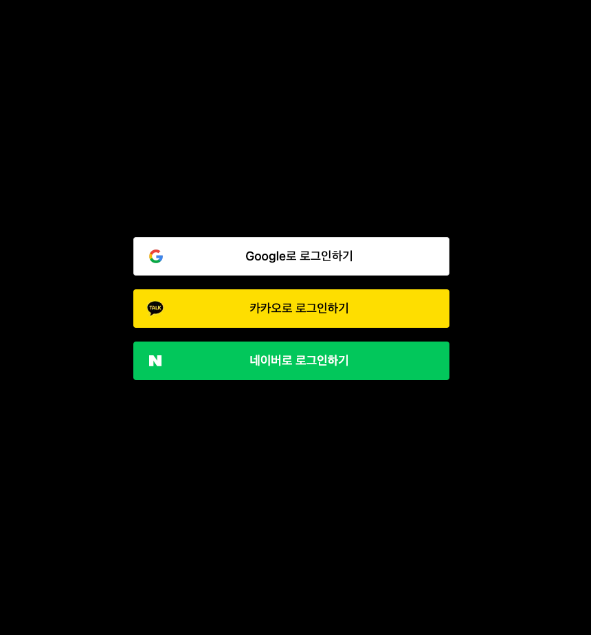

# next13-nextauth-oauth2.0

이 프로젝트는 Next.js, React, JavaScript를 기반으로 구축되었으며, Next Auth 라이브러리를 활용하여 OAuth 2.0을 기반으로 한 소셜 로그인 기능을 제공합니다. (네이버/카카오/구글)

또한, Tailwind CSS를 사용하여 반응형 디자인을 구현하고 있습니다.


## Run

### 1. NPM install 
```shell
npm i
```

### 2. 애플리케이션 환경 설정
```shell
.env 파일을 열어 아래 빈 값 채워넣기.

NEXTAUTH_SECRET=    # https://next-auth.js.org/configuration/options#secret 참고
NEXT_PUBLIC_CALLBACKURL=http://localhost:3000

# OAuth Key - Kakao
OAUTH_KAKAO_CLIENT_ID=
OAUTH_KAKAO_CLIENT_SECRET=

# OAuth key - Google
OAUTH_GOOGLE_CLIENT_ID=
OAUTH_GOOGLE_CLIENT_SECRET=

# OAuth key - Naver
OAUTH_NAVER_CLIENT_ID=
OAUTH_NAVER_CLIENT_SECRET=
```

### 3. 애플리케이션 실행
```shell
npm run dev 
또는
next dev
```


### 4. 실행 확인
- localhost:3000

## 로그인 페이지 확인


## Reference
https://next-auth.js.org/getting-started/introduction

https://nextjs.org/docs
